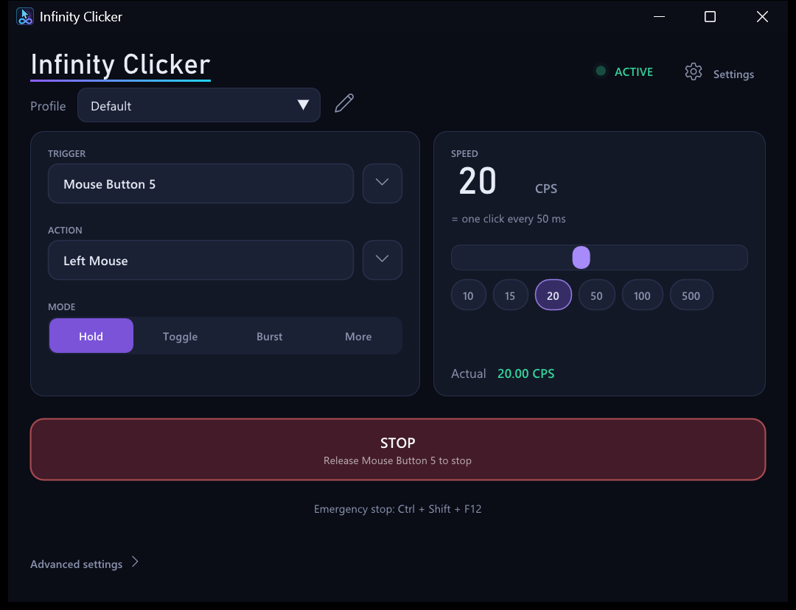
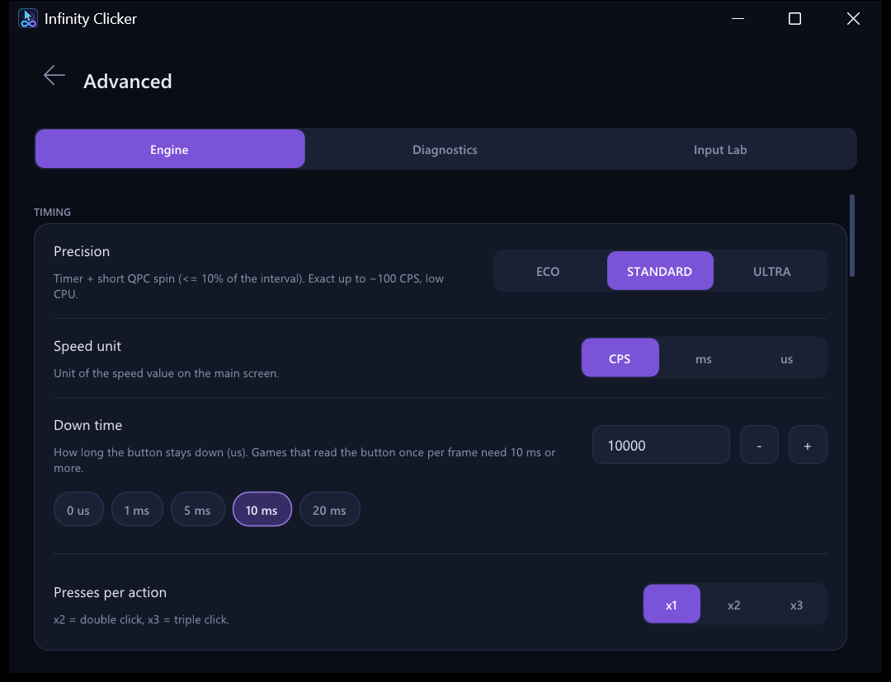
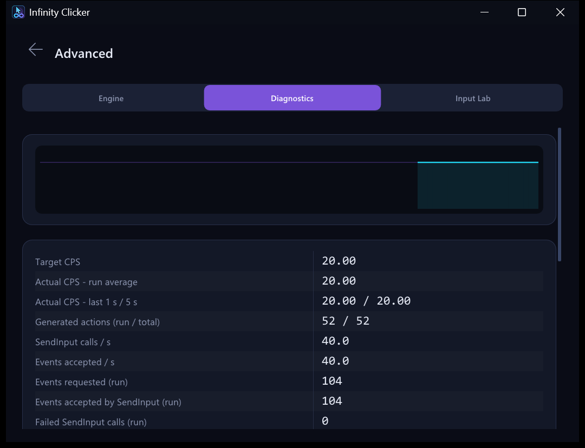

# Infinity Clicker

Native Windows autoclicker focused on precise timing and measurable input performance.

[](https://github.com/ilyasaffonovv-commits/Infinity-Clicker/actions/workflows/build.yml)

<p align="center"></p>

Русская версия: [README.ru.md](README.ru.md)

## Download

Get `InfinityClicker-v1.0.0-win64.zip` from the [Releases](https://github.com/ilyasaffonovv-commits/Infinity-Clicker/releases/latest)
page, unpack it anywhere and run `InfinityClicker.exe`. It is a single portable executable of about 1.4 MB for 64-bit Windows.
I develop and test it on Windows 11; it should also run on Windows 10 1809 or newer, but I have not tried that.
Settings go to a `data` folder next to it. Nothing is installed, and nothing is written to the registry unless
you turn on "Start with Windows".

The exe is not code-signed, so SmartScreen may show a warning the first time you run it.

## Features

- Trigger: any keyboard key, mouse button (including Mouse 4 / 5) or wheel notch, alone or with modifiers. You click the
  field and press the key. The trigger can optionally be hidden from other programs.
- Action: any key, mouse button or wheel notch, combinations like `Ctrl+Shift+K`, double and triple presses, a
  configurable time between button down and up.
- Modes: Hold, Toggle, Burst, Fixed count, Duration.
- Speed in clicks per second, or as an interval in ms / us. There is no built-in cap. The main screen shows the
  measured rate next to the target, so you can see when the system cannot keep up.
- Its own input is tagged and never triggers itself, so a setup like "hold the left button to click the left button"
  works.
- Emergency stop hotkey (`Ctrl+Shift+F12` by default). Held keys and buttons are released on stop, on exit, on a crash,
  and by a small watchdog process if the app is killed from the task manager.
- Optional restriction to a foreground application (e.g. only while `javaw.exe` is in front).
- Profiles saved as JSON, tray icon, English and Russian interface (follows the Windows language).
- Diagnostics, a test window for measuring what an application actually receives, and a benchmark (see below).

## Usage

**Trigger.** Click the field and press the key or mouse button that should start the clicking. The arrow next to it
opens the full key list, which is handy for keys that are awkward to press.

**Action.** What gets clicked or pressed. Same binding as the trigger.

**Mode.**

- Hold: click while the trigger is held.
- Toggle: press once to start, press again to stop.
- Burst: a fixed number of actions per press (pressing again while it runs adds another batch).
- More: Fixed count (run N actions, then stop) and Duration (run for a set time).

**Speed.** Drag the slider, click a preset, or click the number and type a value (anything above 1000 CPS has to be
typed). "Actual" under the slider is measured while it runs.

**ARM / ARMED / STOP.** It starts armed, so the trigger works immediately. Click the big button to disarm and arm
it again; while clicking it turns into STOP.

**Profiles.** The drop-down at the top switches profiles; the pencil next to it opens the profile manager. Profiles are
stored in `data\profiles.json`.

Output pauses on its own while the app's window is in front, so a click never lands on its own controls.

### Advanced

"Advanced settings" at the bottom of the main screen opens three tabs.

- **Engine**: precision (ECO, STANDARD, ULTRA), unit of the speed value, down time, presses per action, scheduler
  thread priority, how late slots are handled, scan-code or virtual-key injection for keyboard actions, hook or Raw
  Input for mouse triggers, values for Burst / Fixed count / Duration, the target-application filter, emergency stop,
  the watchdog, and the experimental MAX mode (send as fast as Windows accepts, no target rate).
- **Diagnostics**: target and measured CPS (1 s, 5 s, whole run), events requested / accepted, how long `SendInput`
  blocks, interval jitter, lateness percentiles, missed deadlines, CPU use, state of the hooks.
- **Input Lab**: opens a small test window that counts the events it receives and lines them up against the events
  the app requested and Windows accepted. Also starts the benchmark.

<p align="center">


</p>

## How the timing works

Clicks are scheduled on an absolute timeline, `start + k * interval` in QueryPerformanceCounter ticks, so a late
wake-up never shifts the clicks after it. The scheduler thread sleeps on a high-resolution waitable timer and spins on
the counter for the last stretch before each deadline. ECO does not spin, STANDARD spins for at most a tenth of the
interval, ULTRA spins as long as it needs. Input goes out through `SendInput`; if the system cannot keep up with one
call per click, the clicks that are already due are sent together, up to 8 per call.

The details and the reasoning behind the choices are in [docs/RESEARCH.md](docs/RESEARCH.md).

## Benchmarks

[BENCHMARK.md](BENCHMARK.md) has the full tables and the raw reports are in `benchmarks/results/`. On my machine
(Ryzen AI 9 HX 370, Windows 11), rates from 1 to 5000 CPS were held within 0.01% and the receiving window got as many
clicks as were generated. Jitter was a few microseconds in ULTRA and a few hundred in STANDARD at 1000 CPS. At 10 000
CPS Windows accepted about 9000 clicks per second and the window received about 6600.

These numbers depend on what else is hooking input on the machine. Within an hour `SendInput` got six times
slower on the same PC (other programs' global hooks, drivers, background load). When it cannot reach the target
rate the main screen says so, and the Diagnostics tab shows how long `SendInput` calls are taking.

## Limitations

- Windows blocks synthetic input into windows running as administrator, and `SendInput` still reports success. If your
  target program is elevated, restart it as administrator (Settings, Diagnostics).
- Nothing can be sent while the screen is locked or a UAC prompt is open.
- Games that read the mouse button once per frame can miss very short clicks. Use a down time of 10-20 ms for those.
  Programs that receive mouse events (browsers, most desktop software, Minecraft Java) see every click.
- It does not try to hide itself. If a server or game forbids autoclickers, don't use it there.

## Building

You need Visual Studio 2022 or newer with the "Desktop development with C++" workload (MSVC, x64, a recent Windows SDK)
and CMake 3.24 or newer. Ninja is used if it is installed.

```bat
build_release.bat
```

The script finds the toolchain with `vswhere`, builds, runs the unit tests and copies `InfinityClicker.exe` to the
repository root. `build_debug.bat` does the same for a debug build. Dear ImGui is vendored under `third_party/imgui`.

`tools/make_icon.py` regenerates the icons (needs Pillow) and `tools/check_i18n.py` checks that every UI string has a
Russian translation.

### Command line

| | |
|---|---|
| `InfinityClicker.exe` | normal start; a second launch just brings the running window to the front |
| `--minimized` | start in the tray |
| `--data <folder>` | use another data folder |
| `--lang en\|ru\|auto` | set the interface language |
| `--bench [quick]` | run the benchmark suite (covers the screen with a test window for a few minutes) |
| `--autotest` | run the functional tests against the real UI (about 30 s, takes over the mouse and keyboard) |

Both `--bench` and `--autotest` only ever click into their own test window, and `Ctrl+Shift+F12` aborts them.

## Repository layout

```
src/core        clock, JSON, log, paths, strings, localization
src/input       key/button model, action compiler, SendInput wrapper, held-key tracking
src/scheduler   engine thread, hybrid wait, trigger modes and the absolute timeline
src/trigger     low-level hooks, Raw Input, key binding, foreground filter, emergency stop
src/telemetry   statistics, CPU meter
src/profiles    profiles and settings
src/platform    power/priority helpers, watchdog process and crash handler, autostart
src/lab         test window, benchmark, functional tests
src/app, src/ui application controller and the ImGui / Direct3D 11 interface
tests/          unit tests
benchmarks/     console benchmark runner and reference results
docs/           research notes
```

## License

MIT, see [LICENSE](LICENSE). Dear ImGui (`third_party/imgui`) is MIT licensed as well.
