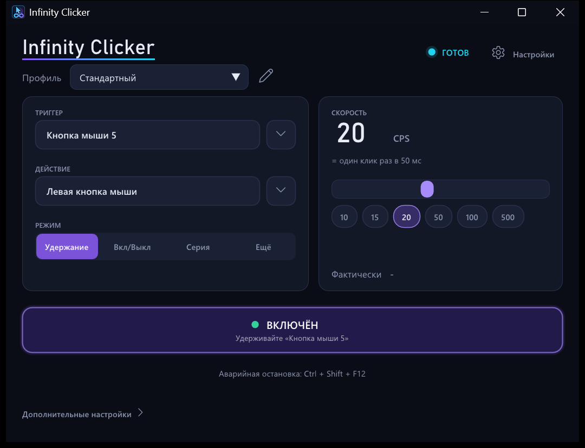

# Infinity Clicker

Нативный автокликер для Windows: точный тайминг и измеримая производительность ввода.

[English version](README.md)

<p align="center"></p>

## Скачать

Возьмите `InfinityClicker-v1.0.0-win64.zip` на странице [Releases](https://github.com/ilyasaffonovv-commits/Infinity-Clicker/releases/latest),
распакуйте куда угодно и запустите `InfinityClicker.exe`. Это один portable-файл около 1.4 МБ для 64-разрядной Windows.
Я разрабатываю и тестирую его на Windows 11; на Windows 10 1809 и новее он тоже должен работать, но я не проверял.
Настройки хранятся в папке `data` рядом с ним. Ничего не устанавливается и ничего не пишется в реестр, если только вы
сами не включите «Запускать вместе с Windows».

Exe не подписан, поэтому при первом запуске SmartScreen может показать предупреждение.

## Возможности

- Триггер: любая клавиша, кнопка мыши (включая кнопки 4 и 5) или шаг колеса, отдельно или с модификаторами. Нужно
  нажать на поле и затем на нужную клавишу. Триггер можно скрывать от других программ.
- Действие: любая клавиша, кнопка мыши или шаг колеса, комбинации вроде `Ctrl+Shift+K`, двойные и тройные нажатия,
  настраиваемая пауза между нажатием и отпусканием.
- Режимы: Удержание, Вкл/Выкл, Серия, Кол-во, Время.
- Скорость в кликах в секунду или интервалом в мс / мкс. Встроенного ограничения нет. Главный экран показывает
  измеренную частоту рядом с целевой, поэтому видно, когда система не успевает.
- Собственный ввод помечается и никогда не запускает сам себя, так что настройка вроде «удерживаю левую кнопку — кликает
  левая кнопка» работает.
- Аварийная остановка (по умолчанию `Ctrl+Shift+F12`). Удержанные клавиши и кнопки отпускаются при остановке, выходе,
  падении, а также небольшим процессом-сторожем, если приложение убито из диспетчера задач.
- Необязательное ограничение по приложению на переднем плане (например, только пока впереди `javaw.exe`).
- Профили в JSON, значок в трее, интерфейс на русском и английском (по языку Windows).
- Диагностика, тестовое окно для измерения того, что приложение реально получило, и бенчмарк.

## Как пользоваться

**Триггер.** Нажмите на поле и затем на клавишу или кнопку мыши, которая должна запускать клики. Стрелка рядом
открывает полный список клавиш — удобно для тех, что неудобно нажимать.

**Действие.** Что кликать или нажимать. Назначается так же, как триггер.

**Режим.**

- Удержание: кликает, пока удерживается триггер.
- Вкл/Выкл: нажали — началось, нажали ещё раз — остановилось.
- Серия: заданное число действий за одно нажатие (повторное нажатие во время серии добавляет ещё одну).
- Ещё: Кол-во (выполнить N действий и остановиться) и Время (работать заданное время).

**Скорость.** Двигайте ползунок, нажимайте на пресет или кликните по числу и введите значение (больше 1000 CPS можно
только ввести). «Фактически» под ползунком измеряется во время работы.

**ВКЛЮЧИТЬ / ВКЛЮЧЁН / СТОП.** Программа стартует включённой: триггер работает сразу. Большая кнопка выключает и снова
включает его; во время кликов она превращается в СТОП.

**Профили.** Список сверху переключает профили, карандаш рядом открывает менеджер профилей. Профили лежат в
`data\profiles.json`.

Пока впереди окно самой программы, вывод автоматически приостанавливается, чтобы клик не попал в её собственные кнопки.

### Дополнительно

«Дополнительные настройки» внизу главного экрана открывают три вкладки.

- **Движок**: точность (ЭКО, СТАНДАРТ, УЛЬТРА), единица скорости, удержание, нажатий за действие, приоритет потока
  планировщика, что делать с опоздавшими слотами, ввод клавиатуры скан-кодом или виртуальным кодом, хук или Raw Input для
  мышиных триггеров, значения для Серии / Кол-ва / Времени, фильтр по приложению, аварийная остановка, процесс-сторож и
  экспериментальный режим MAX (так быстро, как принимает Windows, без целевой частоты).
- **Диагностика**: целевой и измеренный CPS (1 с, 5 с, за запуск), запрошенные и принятые события, сколько
  блокируется `SendInput`, джиттер интервалов, процентили опозданий, пропущенные дедлайны, нагрузка на CPU, состояние
  хуков.
- **Лаборатория**: открывает маленькое тестовое окно, которое считает получаемые события и сопоставляет их с тем, что
  запросила программа и что принял Windows. Отсюда же запускается бенчмарк.

## Как работает тайминг

Клики планируются на абсолютной шкале времени, `старт + k × интервал` в тиках QueryPerformanceCounter, поэтому позднее
пробуждение не сдвигает следующие клики. Поток планировщика спит на high-resolution waitable timer и крутится на счётчике
последний отрезок перед каждым дедлайном. ЭКО не крутится, СТАНДАРТ — не дольше десятой части интервала, УЛЬТРА — сколько
нужно. Ввод отправляется через `SendInput`; если система не успевает по одному вызову на клик, уже наступившие клики
отправляются вместе, до 8 за вызов.

Подробности и обоснование выбора — в [docs/ru/RESEARCH.ru.md](docs/ru/RESEARCH.ru.md).

## Бенчмарки

Полные таблицы — в [docs/ru/BENCHMARK.ru.md](docs/ru/BENCHMARK.ru.md) (английская версия: [BENCHMARK.md](BENCHMARK.md)),
сырые отчёты — в `benchmarks/results/`. На моём компьютере (Ryzen AI 9 HX 370, Windows 11) частоты от 1 до 5000 CPS
держались с ошибкой до 0.01%, а окно получало столько кликов, сколько было сгенерировано. Джиттер — несколько микросекунд
в УЛЬТРА и несколько сотен в СТАНДАРТ на 1000 CPS. На 10 000 CPS Windows принимала около 9000 кликов в секунду, а окно
получало около 6600.

Эти цифры зависят от того, что ещё перехватывает ввод на машине. В течение часа `SendInput` на том же ПК стал медленнее в
шесть раз (глобальные хуки других программ, драйверы, фоновая нагрузка). Когда выйти на целевую частоту не получается,
главный экран говорит об этом, а вкладка «Диагностика» показывает, сколько длятся вызовы `SendInput`.

## Ограничения

- Windows не пропускает синтетический ввод в окна, запущенные от администратора, а `SendInput` при этом всё равно
  сообщает об успехе. Если нужная программа запущена от администратора, перезапустите её так же (Настройки,
  Диагностика).
- Пока экран заблокирован или открыт запрос UAC, ничего отправить нельзя.
- Игры, которые проверяют кнопку мыши раз в кадр, могут пропускать очень короткие клики; для них ставьте удержание
  10–20 мс. Программы, получающие события мыши (браузеры, большинство обычного софта, Minecraft Java), видят каждый клик.
- Программа не пытается прятаться. Если сервер или игра запрещает автокликеры — не используйте его там.

## Сборка

Нужны Visual Studio 2022 или новее с рабочей нагрузкой «Разработка классических приложений на C++» (MSVC, x64, свежий
Windows SDK) и CMake 3.24 или новее. Ninja используется, если установлен.

```bat
build_release.bat
```

Скрипт находит компилятор через `vswhere`, собирает, запускает юнит-тесты и копирует `InfinityClicker.exe` в корень репозитория.
`build_debug.bat` делает то же для отладочной сборки. Dear ImGui лежит в `third_party/imgui`.

### Командная строка

| | |
|---|---|
| `InfinityClicker.exe` | обычный запуск; повторный запуск просто выводит открытое окно на передний план |
| `--minimized` | запуск в трей |
| `--data <папка>` | другая папка данных |
| `--lang en\|ru\|auto` | язык интерфейса |
| `--bench [quick]` | бенчмарк (на несколько минут закрывает экран тестовым окном) |
| `--autotest` | функциональные тесты на реальном интерфейсе (около 30 с, перехватывают мышь и клавиатуру) |

`--bench` и `--autotest` кликают только в собственное тестовое окно, прервать их можно `Ctrl+Shift+F12`.

## Лицензия

MIT, см. [LICENSE](LICENSE). Dear ImGui (`third_party/imgui`) тоже распространяется под MIT.
